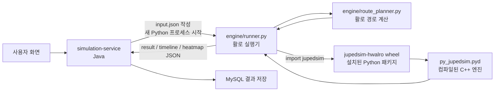
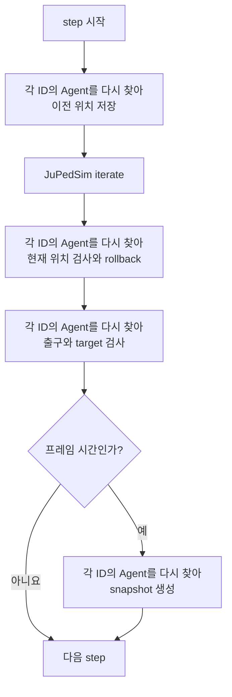
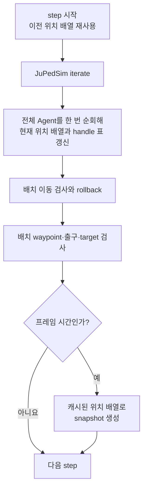

# SCRUM-60 시뮬레이션 1차 성능 개선

## 1. 다섯 문장 요약

활로는 JuPedSim을 사용하지만, 이 폴더에 JuPedSim 전체 소스가 들어 있는 것은 아니다. 활로의 Python 실행기인 `runner.py`가 설치된 JuPedSim wheel을 호출한다. 변경 전 실행기는 사람 한 명을 처리할 때마다 전체 사람 목록을 다시 찾게 만들어, 반복 처리 일부가 사람 수의 제곱에 가까워질 수 있었다. 이번 변경은 그 재검색을 없앴고, 500명·100스텝 실측 중앙값을 4.615초에서 3.809초로 0.806초(17.5%) 줄였다. 그러나 5,000명·10스텝과 시작 준비 구간은 빨라지지 않았으므로 1차 개선만으로 충분하다고 결론내릴 수 없다.

## 2. 시스템은 어떻게 이어지는가



이 그림의 결론은 다음과 같다. `engine` 폴더에는 활로가 만든 실행기와 경로 계산기가 있다. JuPedSim 본체는 `engine/.venv` 안에 wheel로 설치되며, 실제 보행 물리 계산은 그 안의 컴파일된 C++ 코드가 한다.

활로의 `requirements.txt`는 `gugukorn/jupedsim-hwalro`가 배포한 wheel을 가리킨다. 현재 측정에 사용한 wheel은 JuPedSim 1.4.2 기반이며, 활로가 벽 밖으로 잘못 이동한 사람을 이전 위치로 되돌릴 수 있도록 `Agent.position`을 쓸 수 있게 한 버전이다. SCRUM-60은 이 wheel이나 JuPedSim의 보행 물리 공식을 바꾸지 않았다.

## 3. 먼저 알아둘 말

| 말         | 쉬운 뜻                                            | 이 프로젝트에서의 정확한 뜻                                  |
| ---------- | -------------------------------------------------- | ------------------------------------------------------------ |
| 라이브러리 | 다른 프로그램이 가져다 쓰는 도구 상자              | 활로가 `import jupedsim`으로 사용하는 코드 묶음              |
| JuPedSim   | 사람들의 이동을 계산하는 엔진                      | 보행 물리와 Agent API를 제공하는 외부 프로젝트               |
| fork       | 원본을 복사해 목적에 맞게 고친 버전                | writable `Agent.position`을 포함한 `jupedsim-hwalro`         |
| wheel      | Python 도구를 설치하기 위한 포장 파일              | Python 코드와 Windows용 C++ `.pyd`를 담은 배포 파일          |
| runner     | 실행 순서를 지휘하는 코드                          | 입력을 읽고 JuPedSim을 반복 실행하며 JSON을 쓰는 `runner.py` |
| Agent      | 시뮬레이션 안의 사람 한 명                         | 위치, 속도, 목표 지점을 가진 JuPedSim 객체                   |
| step       | 아주 짧은 한 번의 시간 진행                        | 현재 설정에서 0.01초, 즉 1초에 100번                         |
| GridRouter | 출구까지 갈 경로를 찾는 활로 코드                  | 격자 비용장과 Dijkstra 방식으로 waypoint를 계산하는 클래스   |
| `N`        | 사람 수                                            | 한 공간 그룹에서 아직 처리 중인 Agent 수                     |
| `T`        | 반복 횟수                                          | 최대 `시뮬레이션 시간 ÷ 0.01초`                              |
| `O(N²)`    | 사람이 2배일 때 일이 약 4배가 될 수 있는 증가 방식 | 사람마다 다시 전체 사람 목록을 찾는 경우                     |
| AABB       | 물체를 둘러싼, 축에 나란한 가장 작은 사각형        | 두 선분이 만날 가능성이 있는지 빠르게 거르는 범위            |

wheel을 상자에 비유할 수는 있지만, 일반 압축 파일과 완전히 같지는 않다. Python 설치 도구가 정해진 규칙으로 설치하며, 이 wheel에는 사람이 읽는 Python 코드뿐 아니라 컴퓨터가 바로 실행하는 C++ 바이너리도 들어 있다.

## 4. 어디에서 제곱에 가까운 일이 생겼는가

### 작은 숫자로 먼저 보기

사람이 3명이라고 가정한다.

변경 전에는 1번 사람을 찾으려고 최대 3명을 확인하고, 2번 사람과 3번 사람도 같은 방식으로 찾을 수 있었다.

```text
3명을 차례로 처리 × 한 명을 찾을 때 최대 3명 확인
= 최대 3 × 3 = 9번 확인
```

변경 후에는 전체 사람 목록을 한 번 받아 `ID → Agent` 표로 정리한다.

```text
전체 목록 3명 확인 + 표에서 바로 찾기
= 사람 수에 비례하는 일
```

이 비유에서 “출석부를 한 번 만든다”는 부분은 실제 `simulation.agents()` 순회와 Python `dict` 생성에 해당한다. 실제 프로그램은 이름이 아니라 JuPedSim의 숫자 ID를 사용한다.

### 실제 코드에서의 원인

[관찰] 변경 전 `runner.py`는 매 step마다 이전 위치 저장, 잘못된 이동 복원, 목표 갱신을 위해 모든 ID에 `simulation.agent(id)`를 호출했다. 화면 프레임을 만들 때도 같은 단건 조회를 사용했다.

[이유] 설치된 JuPedSim 1.4.2의 단건 `agent(id)` 조회는 내부 Agent 저장소에서 ID를 찾는다. 이 API를 가끔 한 사람만 확인할 때 쓰는 것은 문제가 작지만, 활로 실행기처럼 모든 사람에게 매 step 반복하면 “전체 처리 × 내부 검색”이 겹친다.

[결론] 제곱 문제가 생긴 곳은 JuPedSim의 핵심 보행 계산이 아니라 활로 실행기가 단건 조회 API를 뜨거운 반복문에서 사용한 부분이다. JuPedSim 프로젝트가 활발한데도 이 API가 남아 있는 것과 모순되지 않는다. JuPedSim 본체의 `iterate()`는 주변 사람을 찾기 위한 공간 자료구조를 사용하고, 단건 조회 API는 모든 Agent를 매번 순회하는 용도로 설계된 것이 아니기 때문이다.

변경 전 해당 조회 부분의 상한은 대략 `O(TN²)`이었다. 이번 변경 뒤 이 부분은 step마다 전체 Agent를 일정 횟수 순회하므로 `O(TN)`이다. 이것은 **실행 전체가 언제나 `O(TN)`이 됐다는 뜻이 아니다.** 경로 준비, 물리 계산, JSON 생성에는 각각 다른 비용이 남아 있다.

## 5. 변경 전과 변경 후 흐름

### 변경 전



같은 step 안에서 사람 목록을 여러 번 단건 검색했다는 것이 이 그림의 핵심이다.

### 현재 변경 후



이전 위치는 stable slot 기반 숫자 배열로 보관한다. `iterate()`가 끝난 뒤 한 번의 새 순회에서 현재 위치와 새 Agent handle을 받고, handle은 해당 iteration 안에서만 사용한다. 따라서 JuPedSim 내부 저장소가 step 사이에 바뀌어도 오래된 handle을 붙잡지 않는다.

## 6. 이번에 바꾼 것

### 6.1 Agent 전체 재검색 제거

- `SimulationContext`는 이전·현재 위치 double buffer와 Agent ID별 stable slot을 유지한다.
- `_advance_context()`는 `iterate()` 뒤 `simulation.agents()`를 한 번만 순회해 현재 위치와 이번 iteration의 handle 표를 갱신한다.
- `_rollback_invalid_moves()`와 `_update_targets()`는 같은 active slot과 NumPy 배열을 사용한다.
- `_snapshot()`은 캐시된 위치 배열을 사용하므로 JuPedSim Agent를 다시 순회하지 않는다.
- 대피가 끝난 공간 그룹은 iteration과 snapshot에서 건너뛴다.

### 6.2 같은 값 다시 읽고 쓰는 일 제거

한 Agent의 `position`은 한 처리 안에서 한 번 읽어 좌표 표에 보관한다. 출구를 교차한 이동은 rollback 대상에서 제외한다. 그 외 잘못된 이동은 보행영역 경계로 보정하고, 보정 경로가 유효하지 않을 때만 이전 위치로 되돌린다. `target`은 처음 정할 때와 waypoint 번호가 바뀔 때만 다시 쓴다.

### 6.3 경로 계산의 안전한 반복 제거

GridRouter의 `reachable` 배열은 도형과 출구가 바뀌지 않는 동안 같은 값이다. 따라서 라우터를 만들 때 한 번 계산하고 각 Agent 경로에서 재사용한다.

출구 교차 검사에는 AABB 조기 종료를 넣었다. 이동 선분을 감싼 사각형과 출구 선분을 감싼 사각형이 완전히 떨어져 있으면 두 선분은 만날 수 없으므로 Shapely 정밀 검사를 하지 않는다. 사각형이 닿거나 겹치면 기존 정밀 검사를 그대로 수행한다.

### 6.4 readiness 성공 결과 기억

Java 서비스는 첫 실행 요청에서 `runner.py --version`을 검사한다. 성공하면 JVM이 끝날 때까지 그 사실을 기억한다. 첫 검사가 성공하면 여러 최초 요청이 동시에 와도 실제 검사는 한 번만 수행한다. 실패는 기억하지 않으므로 기다리던 다음 요청이 차례로 다시 검사할 수 있다.

이 캐시는 실제 시뮬레이션 실행을 생략하지 않는다. wheel이 서비스 실행 중 사라지면 다음 요청의 사전 검사는 지나갈 수 있지만, 실제 worker 실행은 기존처럼 실패 처리된다. 배포 중 엔진을 바꿀 때 서비스도 재시작한다는 운영 전제가 있다.

### 6.5 시간이 어디에서 쓰였는지 로그로 분리

Java 표준 `System.nanoTime()`과 기존 SLF4J만 사용했다. 새 라이브러리, DB 열, 공개 API는 추가하지 않았다.

- `simulation_execution_phase`: readiness, setup, queue, engine, DB 저장, worker 전체 시간
- `simulation_engine_phase`: input 쓰기, Python 프로세스, result/timeline/heatmap 읽기, 임시 파일 삭제, 전체 시간
- 함께 기록하는 양: timeline/heatmap 청크 수와 문자 수
- 기록하지 않는 것: 사람 좌표, 입력·출력 JSON 본문, 민감한 요청 내용

## 7. 결과가 바뀌지 않았는지 확인한 방법

[실측] 성능 비교의 7개 시나리오는 준비 실행과 7회 측정에서 `result.json`, 모든 timeline 청크, 모든 heatmap 청크의 상대 경로, 크기, SHA-256을 비교했다. 총 112번의 새 Python 프로세스 실행에서 한 파일도 달라지지 않았다.

[실측] 아래 5개 정확성 시나리오는 준비 실행 1쌍과 측정 1쌍을 따로 실행했다. 출력 JSON뿐 아니라 각 Agent 경로의 출구 ID, waypoint, terminal point, 출구 선분, 비용을 직렬화한 원시 바이트도 비교했다.

| 상황                      | 실제로 확인한 결과                      | 출력 SHA-256        | 경로 SHA-256      |
| ------------------------- | --------------------------------------- | ------------------- | ----------------- |
| 벽 우회와 rollback        | 1명, 2.10초에 전원 대피                 | `057a6b43...e67f32` | `e9c09635...d817` |
| 1.2m 좁은 병목            | 5명, 12.24초에 전원 대피                | `90db088d...3e519`  | `3b04adcb...007b` |
| 위험 구역과 복수 출구     | 위험에서 먼 `exitId=2`, 3.70초 대피     | `572418dd...be120`  | `524bcca3...6c6f` |
| 분리 공간과 동시 대피     | 두 명 모두 0.65초, 서로 다른 출구       | `1617ebc8...da4e`   | `3dae37dc...82e`  |
| 출구와 연결되지 않은 사람 | 1명 즉시 대피, 1명은 0.05초 뒤에도 잔류 | `974e823f...f5e6`   | `73e45085...c658` |

여기서 SHA-256은 파일의 모든 바이트로 만든 긴 지문이다. 내용 한 글자만 달라도 보통 전혀 다른 값이 된다. benchmark는 해시만 기록하는 데 그치지 않고 파일 이름과 바이트 크기도 함께 비교한다.

단위 테스트는 다음 순서를 따로 고정한다.

- 뜨거운 전체-Agent 처리에서 `simulation.agent(id)` 호출 0회
- `iterate()` 전후 handle을 새로 받음
- 위치 getter와 target setter 횟수
- 출구 교차 판정 뒤 rollback 대상 제외
- rollback 뒤 실제 위치, 벽면 방향 속도, 좌표 표
- waypoint가 바뀔 때 target을 정확히 한 번 갱신
- Agent가 없는 공간 그룹은 snapshot 순회 생략
- AABB가 떨어진 경우 정밀 도형 검사 생략
- readiness 성공 캐시, 실패 후 재시도, 첫 검사가 성공할 때 동시 최초 요청 1회

## 8. 성능 측정 방법

### 비교 기준

- baseline: `c26a13a49bf0e89e25a549c506570b4690012ffe`
- 성능 candidate: `cfe83710f92b0b63d3f1dcf7217e4e6e5c867743`
- 정확성 benchmark 확장까지 포함한 candidate: `4483a43ae058c621d9e678c0cf2459e04e63bedf`
- 두 성능 구현은 깨끗한 worktree에서 실행했다.
- 둘 다 같은 Python 실행 파일과 같은 JuPedSim wheel을 사용했다.
- 각 실행은 새 Python 프로세스였다.
- 구현별 첫 준비 실행 1회는 통계에서 뺐다.
- 각 시나리오는 회차마다 `dev → candidate`와 `candidate → dev` 순서를 번갈아 사용했다. 어느 순서로 시작할지도 시나리오마다 바꿨다.
- 방 면적은 사람 수와 같은 비율로 키워 scaling 시나리오의 전역 밀도를 정확히 1명/㎡로 고정했다.

계산식은 다음과 같다.

```text
단축 시간 = dev 중앙값 - candidate 중앙값
개선율 = 단축 시간 ÷ dev 중앙값 × 100
배속 = dev 중앙값 ÷ candidate 중앙값
```

중앙값은 7개 시간을 작은 순서로 놓았을 때 가운데 값이다. 매우 느린 한 번이 섞여도 평균보다 덜 흔들리기 때문에 사용했다.

### 측정 환경

| 항목                  | 값                                                                 |
| --------------------- | ------------------------------------------------------------------ |
| 측정 날짜             | 2026-08-10                                                         |
| 운영체제              | Windows 11, build 26200                                            |
| CPU                   | 12th Gen Intel Core i9-12900H, 논리 CPU 20개                       |
| RAM                   | 31.70 GiB                                                          |
| Python                | CPython 3.12.13, 64-bit                                            |
| JuPedSim 배포 버전    | 1.4.2                                                              |
| 활로 build commit     | `8621dd71`                                                         |
| native `.pyd` SHA-256 | `0d95733ce357d2a1d407f9ff2b0652b9f529d2aeb1f7004ae80969885141a204` |

## 9. 변경 전·후 시간

[실측] 아래 값은 준비 실행을 뺀 7회 중앙값이다. 음수 개선율은 후보가 느렸다는 뜻이다.

[중요] 이 표는 Python runner 한 번의 전체 시간이다. 새 Python 프로세스 시작, import, 경로 준비, JuPedSim 반복, JSON 쓰기를 포함하지만 Java 요청 처리, queue, 결과 파일 읽기, DB 저장은 포함하지 않는다.

| 시나리오                 |   dev 중앙값<br/>(최소~최대) | candidate 중앙값<br/>(최소~최대) |     단축 | 개선율 |     배속 |
| ------------------------ | ---------------------------: | -------------------------------: | -------: | -----: | -------: |
| 기본 도면·100명·1스텝    |    7.709초<br/>(6.663~9.444) |       8.637초<br/>(7.450~17.464) | -0.929초 | -12.0% | 0.8925배 |
| 열린 공간·500명·100스텝  |    4.615초<br/>(4.066~5.393) |        3.809초<br/>(3.560~4.469) |  0.806초 |  17.5% | 1.2117배 |
| 고정 밀도·100명·10스텝   |    1.188초<br/>(1.085~1.413) |        1.132초<br/>(1.030~1.285) |  0.056초 |   4.7% | 1.0496배 |
| 고정 밀도·500명·10스텝   |    1.907초<br/>(1.598~2.059) |        1.877초<br/>(1.774~2.464) |  0.030초 |   1.5% | 1.0157배 |
| 고정 밀도·1,000명·10스텝 |    3.137초<br/>(2.729~3.776) |        2.808초<br/>(2.620~2.956) |  0.329초 |  10.5% | 1.1173배 |
| 고정 밀도·2,500명·10스텝 | 12.507초<br/>(11.001~14.708) |     12.236초<br/>(11.688~12.807) |  0.272초 |   2.2% | 1.0222배 |
| 고정 밀도·5,000명·10스텝 | 30.369초<br/>(26.273~44.950) |     30.451초<br/>(23.833~37.200) | -0.082초 |  -0.3% | 0.9973배 |

[관찰] 500명·100스텝처럼 반복 횟수가 많은 구간은 17.5% 빨라졌다. 이는 매 step의 불필요한 Agent 검색을 없앤 변경과 방향이 맞는다.

[관찰] 5,000명·10스텝은 차이가 없었다. [추론] step이 10번뿐인 반면 5,000명의 경로를 준비해야 하므로, 이번에 줄인 반복 조회가 전체에서 차지하는 비율이 작았을 가능성이 있다. benchmark가 Python 내부 단계를 나눠 재지 않았으므로 원인으로 확정하지 않는다.

[관찰] 기본 도면 첫 측정의 중앙값은 candidate가 12.0% 느렸다. candidate 원시값에는 17.464초라는 큰 이상값도 있었지만, 이 최댓값 하나가 7개 중 가운데 값인 중앙값을 직접 결정한 것은 아니다. 첫 묶음 전체의 변동 폭이 컸다는 별도 증거다. 같은 조건을 독립적으로 7회 재측정하니 dev 5.501초, candidate 5.506초로 차이는 -0.005초(-0.1%)였다. 따라서 최초의 12% 차이는 재현되지 않았지만 원인을 특정하지도 못했으며, 이 시작 구간이 빨라졌다고 말할 수 없다.

[결론] 1차 개선은 실제 반복 처리 병목 하나를 줄였지만 전체 느림을 해결하지 않았다. 특히 큰 도면의 경로 준비와 Python 프로세스 시작이 지배하면 개선이 거의 보이지 않는다. 그러므로 “1차만으로 충분하다”가 아니라 “안전한 첫 병목을 제거했고 2차 측정이 필요하다”가 정확한 결론이다.

## 10. readiness 캐시의 절감량

[실측] dev와 candidate의 `runner.py --version`을 각각 준비 실행한 뒤, 새 프로세스로 7회씩 번갈아 실행했다.

```text
dev:       0.918, 0.898, 0.979, 0.916, 0.951, 2.712, 4.590초
candidate: 0.989, 0.969, 1.009, 0.940, 0.938, 2.202, 5.995초
dev 중앙값: 0.951초
candidate 중앙값: 0.989초
```

[계산] 같은 JVM에서 실행 요청이 7번 오면 dev는 7번 검사하고 candidate는 첫 요청만 검사한다. 없어진 6회에 dev 중앙값을 곱하면 `6 × 0.951 = 5.705초`이다. 두 버전의 중앙값 차이까지 포함해 7개 요청의 readiness 시간만 계산하면 `7 × 0.951 - 0.989 = 5.667초`이다.

이 값은 API 전체 응답 시간을 잰 값이 아니다. DB 조회, 네트워크, 요청 처리 시간을 포함하지 않은 readiness 프로세스 비용의 계산값이다.

## 11. 아직 느릴 수 있는 부분

1. GridRouter는 Agent마다 경로를 만든다. 큰 도면에서 사람이 많으면 경로 준비가 전체 시간을 지배할 수 있다.
2. Python 프로세스는 실제 실행마다 새로 시작한다. readiness만 캐시했으며 실제 runner import 비용은 남아 있다.
3. 0.01초 step을 600초 실행하면 최대 60,000번 반복한다. 사람 수와 step 수가 모두 크면 `O(TN)`도 큰 값이다.
4. 프레임마다 Agent를 정렬하고 timeline·heatmap용 자료를 만든다. JSON 파일 쓰기는 20프레임이 모이거나 마지막 프레임에 도달했을 때 수행한다. Java는 결과 파일을 메모리로 읽은 뒤 DB에 청크별로 저장한다.
5. worker는 한 번에 한 시뮬레이션만 실행한다. 동시에 요청이 많으면 queue 대기 시간이 늘어난다.

Java 로그가 이 다섯 영역을 완전히 분리하는 것은 아니다. 특히 `pythonProcessMs`에는 Python 시작, import, 경로 준비, 물리 반복, JSON 쓰기가 모두 포함된다. 다음 단계에서는 Python 내부 시간을 나눠 가장 큰 남은 구간을 먼저 골라야 한다.

## 12. 이번에 바꾸지 않은 것과 이유

- JuPedSim wheel/C++: 현재 제곱 문제는 활로 API 사용 방식에서 확인됐으므로 위험이 큰 native 배포 변경을 먼저 할 이유가 없었다.
- Dijkstra와 경로 단순화: 경로 선택 결과를 바꿀 위험이 있어 별도 회귀 설계와 측정이 필요하다.
- step 0.01초: 키우면 빨라지지만 물리 결과가 달라질 수 있어 순수 성능 개선이 아니다.
- frame 간격: 키우면 파일은 작아지지만 화면 시간 해상도가 낮아진다.
- 결과 streaming/batch DB 저장: 실제 `resultReadMs`, 문자량, `persistMs`를 운영 로그로 확인한 뒤 결정해야 한다.
- Python 상주 worker: import는 한 번만 할 수 있지만 IPC, 충돌 복구, 시뮬레이션 상태 초기화가 새로 필요하다.
- worker 병렬 수 증가: CPU와 RAM 경쟁, 중복 실행 방지 lease를 먼저 검증해야 한다.

## 13. 기술 부록

### 13.1 변경 파일과 함수

| 파일                              | 주요 변경                                                                                                     |
| --------------------------------- | ------------------------------------------------------------------------------------------------------------- |
| `engine/runner.py`                | `_active_agents_and_positions`, `_initialize_targets`, `_advance_context`; bulk Agent 처리와 handle 수명 제한 |
| `engine/route_planner.py`         | `GridRouter._reachable` 캐시, `crossed_exit` AABB 조기 종료                                                   |
| `engine/test_runner.py`           | bulk 접근, getter/setter 횟수, rollback 순서, 빈 context 테스트                                               |
| `engine/test_route_planner.py`    | AABB와 reachable 결정성 테스트                                                                                |
| `engine/benchmark.py`             | 교대 실행, 통계, 출력·경로 동등성, 환경·SHA 기록                                                              |
| `SimulationExecutionService.java` | readiness 성공 캐시, 요청/worker 단계 로그                                                                    |
| `SimulationEngineRunner.java`     | 파일·프로세스·읽기·cleanup 단계 로그                                                                          |
| Java 테스트 2개                   | 캐시 성공/실패/동시성, phase 로그 검증                                                                        |

공개 API, DTO, DB schema, mapper SQL, 프론트엔드, wheel은 바뀌지 않았다.

### 13.2 Agent handle 수명 규칙

```text
iterate 전 agents() 순회
→ 위치 숫자 tuple만 보관
→ iterate 실행
→ 이전 Agent handle은 사용하지 않음
→ agents()를 새로 순회
→ 이번 step 안에서만 Agent handle 사용
→ 다음 iterate로 넘기지 않음
```

### 13.3 rollback 순서

```text
1. iterate 전 위치 저장
2. JuPedSim iterate
3. iterate 후 위치 저장
4. 출구 교차를 한 번에 판정
5. 출구를 교차한 Agent를 rollback 대상에서 제외
6. 나머지 이동 선분을 한 번에 유효성 검사
7. 잘못된 위치를 보행영역 경계로 보정하고 연결할 수 없으면 이전 위치로 복원
8. 보정 방향의 velocity 성분만 제거해 벽면 방향 이동은 유지
9. 보정된 위치 표로 waypoint와 출구 도달 여부 판단
```

출구 교차를 먼저 판단하지 않으면 출구 밖으로 이동한 Agent가 일반 보행영역 이탈로 rollback되어 출구에 정체될 수 있다. 테스트는 출구 교차 Agent가 rollback에서 제외되는지와 일반적인 잘못된 이동의 위치·velocity 보정을 각각 확인한다.

### 13.4 STALLED 판정 기준

`STALLED`는 엔진이 이동을 시도했는지가 아니라 위치 보정까지 끝난 뒤 Agent가 실제로 이동했는지를 기준으로 한다. 모든 active Agent의 실제 이동거리 합계가 한 iteration에 0.001m 미만인 상태가 500회(5초) 연속될 때만 종료한다. Agent가 대피하거나 이동거리 합계가 기준 이상이면 연속 횟수는 즉시 초기화된다.

출구를 통과한 Agent는 rollback 대상에서 제외되고 제거되므로 정상적인 출구 대기열에서는 앞 Agent가 제거된 뒤 뒤 Agent가 전진하면서 연속 횟수가 초기화된다. rollback 전 이동량을 사용하면 벽이나 잘못된 geometry 방향으로 계속 이동을 시도하지만 실제 위치는 변하지 않는 교착 상태를 움직이는 것으로 오인하므로 사용하지 않는다.

### 13.5 AABB가 안전한 이유

이동 선분의 x 범위를 `[min(moveX), max(moveX)]`, 출구 선분의 x 범위를 `[min(exitX), max(exitX)]`라고 한다. 두 x 범위가 완전히 떨어지거나 두 y 범위가 완전히 떨어지면 두 선분이 공유할 점은 없다. 따라서 `False`를 즉시 반환해도 결과가 바뀌지 않는다. 범위가 닿는 경우에는 `<`와 `>`의 엄격한 비교를 통과하므로 기존 Shapely 검사를 실행한다.

### 13.6 Java 로그 필드

`simulation_execution_phase`:

```text
simulationId, outcome, readinessChecked, readinessMs, setupMs,
queueMs, engineMs, persistMs, workerMs
```

`simulation_engine_phase`:

```text
simulationId, outcome, inputWriteMs, pythonProcessMs, resultReadMs,
timelineReadMs, heatmapReadMs, cleanupMs, totalMs,
timelineChunks, timelineChars, heatmapChunks, heatmapChars
```

`Ms`는 벽시계가 아니라 monotonic timer로 잰 경과 밀리초다. `Chars`는 Java String 문자 수이며 파일 byte 수가 아니다.

### 13.6 재실행 명령

성능 7회 비교:

```powershell
.\apps\simulation-service\engine\.venv\Scripts\python.exe `
  .\apps\simulation-service\engine\benchmark.py `
  --baseline-root C:\path\to\dev-worktree `
  --candidate-root C:\path\to\feat-worktree `
  --python .\apps\simulation-service\engine\.venv\Scripts\python.exe `
  --runs 7 `
  --output C:\path\to\temporary-result-directory
```

정확성 시나리오 1회 비교:

```powershell
.\apps\simulation-service\engine\.venv\Scripts\python.exe `
  .\apps\simulation-service\engine\benchmark.py `
  --baseline-root C:\path\to\dev-worktree `
  --candidate-root C:\path\to\feat-worktree `
  --python .\apps\simulation-service\engine\.venv\Scripts\python.exe `
  --runs 1 `
  --scenario 'correctness-*' `
  --output C:\path\to\temporary-correctness-result
```

자동 테스트:

```powershell
cd apps\simulation-service
.\engine\.venv\Scripts\python.exe -m unittest discover -s engine -p "test_*.py" -v
$env:RUN_JUPEDSIM_SMOKE = "1"
.\engine\.venv\Scripts\python.exe -m unittest discover -s engine -p "test_*.py" -v
.\gradlew.bat spotlessCheck
.\gradlew.bat test
```

### 13.7 성능 측정 원시 시간

각 줄은 실행 순서대로 기록한 초 값 7개다.

```text
startup dev       9.444, 7.971, 7.327, 6.663, 6.860, 7.709, 8.091
startup candidate 8.637, 7.450, 17.464, 7.933, 10.068, 10.285, 8.125
runtime dev       4.461, 4.615, 4.740, 4.886, 4.311, 4.066, 5.393
runtime candidate 3.560, 4.372, 3.706, 4.469, 3.968, 3.609, 3.809
100 dev           1.085, 1.413, 1.260, 1.119, 1.188, 1.138, 1.294
100 candidate     1.049, 1.192, 1.104, 1.030, 1.285, 1.138, 1.132
500 dev           1.839, 2.012, 1.850, 2.049, 1.907, 2.059, 1.598
500 candidate     1.869, 2.464, 1.877, 2.345, 2.004, 1.845, 1.774
1000 dev          2.729, 3.776, 3.509, 3.137, 3.570, 2.933, 2.786
1000 candidate    2.740, 2.620, 2.818, 2.822, 2.956, 2.808, 2.786
2500 dev          11.226, 14.708, 12.507, 13.858, 11.001, 11.322, 13.704
2500 candidate    12.807, 12.160, 12.236, 12.106, 12.384, 11.688, 12.527
5000 dev          30.008, 31.276, 30.369, 44.795, 44.950, 26.273, 26.323
5000 candidate    37.200, 30.451, 30.919, 32.988, 24.780, 23.833, 27.007

startup 독립 재측정 dev
5.566, 5.523, 5.571, 5.392, 5.347, 5.496, 5.501
startup 독립 재측정 candidate
5.444, 5.506, 5.540, 5.404, 5.509, 5.519, 5.407
```

### 13.8 성능 출력 전체 해시

```text
startup  9c211cbecc54dfcb7352e8b59ed65a841c804b449fddec449ed49bb0e148b529
runtime  ee52b815ecf97791bec7f1ab9a3fb3696ae6b1f1f8b81d5cbd0b5443db77d93d
100      f6af17a81a8706675ac9c3ae2bcb25b03b529c8b34930322228256e350c7caaa
500      fccc8b03d92ad99a3e804ead2a70707200f8567ec88caf21daa058a1d194b7ac
1000     fc96c51b3c39e200f3174d7567693fedcce4d7126ec85d235898e9f782435101
2500     1432fbe8b395c50affbb25a45cd01516fd07ab85751cb2ac9f4713d237d04c35
5000     35fafe60429b68bd775890771eb14ff57e93c4ddd8903b88f5662758a0e914fd
```

이 해시는 dev와 candidate가 같은 값을 냈으며, 준비 실행과 7회 측정에서도 변하지 않았다.

### 13.9 정확성 경로와 전체 해시

아래 경로 값도 dev와 candidate가 원시 바이트까지 같았다. `waypoints`는 Agent가 차례로 향하는 좌표다. `terminal`은 출구 선분 위의 마지막 목적점이다.

| 상황·Agent       |      출구 | waypoints                                                | terminal  |     비용 |
| ---------------- | --------: | -------------------------------------------------------- | --------- | -------: |
| 벽 rollback·1    |         1 | `(1,2) → (1,2.75) → (2.75,4.5) → (5.7,4.5)`              | `(6,4.5)` | 6.474874 |
| 병목·1           |         2 | `(1,1) → (1.75,1) → (2.5,1.75) → (5.5,1.75) → (5.7,1.8)` | `(6,1.8)` | 5.313154 |
| 병목·2           |         2 | `(1,2) → (5.7,2)`                                        | `(6,2)`   | 5.000000 |
| 병목·3           |         2 | `(1,3) → (1.75,2.25) → (5.5,2.25) → (5.7,2.2)`           | `(6,2.2)` | 5.313154 |
| 병목·4           |         2 | `(2,1.5) → (2.25,1.75) → (5.5,1.75) → (5.7,1.8)`         | `(6,1.8)` | 4.106047 |
| 병목·5           |         2 | `(2,2.5) → (2.25,2.25) → (5.5,2.25) → (5.7,2.2)`         | `(6,2.2)` | 4.106047 |
| 위험·복수 출구·1 |         2 | `(3.5,2) → (7.7,2)`                                      | `(8,2)`   | 4.666667 |
| 분리 공간·1      |         1 | `(1,2) → (0.3,2)`                                        | `(0,2)`   | 1.000000 |
| 분리 공간·2      |         2 | `(5,2) → (5.7,2)`                                        | `(6,2)`   | 1.000000 |
| 고립·1           |         1 | `(0.5,2) → (0.3,2)`                                      | `(0,2)`   | 0.500000 |
| 고립·2           | 연결 없음 | `trapped`                                                | 없음      |     없음 |

정확성 출력/경로의 전체 SHA-256은 다음과 같다.

```text
wall-rollback output 057a6b43cf347f8da914a7fac1f48cc4ce5d8e06cb6e2396669c6e1250e67f32
wall-rollback route  e9c096350bde6eddbd6c25345e1ac3de032bc7b7ad5e00552286ff887af8d817
bottleneck output    90db088dc2c387794c27edf797cd5292fbbccc0f01b6148469ca113f8fa3e519
bottleneck route     3b04adcbdf76197e22ac980954aa0aeac9ddd07a067f923a884084627d01007b
hazard-exits output  572418dd5294e888edb1b8a9d69b1c6f7c5d5fae2ed6ff2161bf51da372be120
hazard-exits route   524bcca3db69e684c95444de0b069b16b0afc4bdf94d65b01491fedd0fee6c6f
multi-context output 1617ebc83dfecc8776b9ade0da1b433e0450d1a8ef05137cd6e153545320da4e
multi-context route  3dae37dcc1e2ed6431a8367f64298054b7c58a690c04a8ab99b060fa3ebad82e
trapped output       974e823fa9afcd3841f7730a84aa17102f98901392259c93a05f513b1797f5e6
trapped route        73e45085b4a7e87db150627f4069cd0514c82a2383ec72bc52ebc2c0c759c658
```

## 14. 다음 결정 기준

운영 로그에서 `pythonProcessMs`가 크면 Python 내부에 route 준비, native iterate, 활로 전후 순회, JSON 쓰기 타이머를 추가한다. 그중 route 준비가 가장 크면 경로 단순화와 Agent별 계획을 2차 후보로 삼는다. `timelineChars`·`heatmapChars`와 `persistMs`가 크면 결과 streaming을 먼저 검토한다. `queueMs`가 크더라도 CPU·RAM과 중복 실행 방지 설계를 확인하기 전에는 worker 수를 바로 늘리지 않는다.

2차 작업은 이 문서의 실측 근거로 별도 티켓에서 다룬다. 1차 코드에 물리 공식, 출력 해상도, 동시성 변경을 섞지 않는다.

## 15. 2차 장시간 benchmark 사용법

저장소와 로컬 임시 측정 자료를 확인했지만 커밋 가능한 익명화 5,000명 운영 입력은 발견되지 않았다. 운영 입력을 임의 생성하거나 기존 입력을 익명화됐다고 가정해 복사하지 않는다. 팀에서 별도로 검토한 파일을 `--production-fixture`로 전달하면 benchmark가 원본 파일은 수정하지 않고 임시 입력에 `maxSimulationTimeSeconds=600`, `frameIntervalSeconds=1`을 적용한다. 입력의 Agent가 정확히 5,000명이 아니면 실행을 거부한다.

서로 다른 wheel 환경을 비교하는 운영 기준 명령은 다음과 같다.

```powershell
python .\apps\simulation-service\engine\benchmark.py `
  --baseline-root C:\path\to\baseline-worktree `
  --candidate-root C:\path\to\candidate-worktree `
  --baseline-python C:\path\to\baseline-venv\Scripts\python.exe `
  --candidate-python C:\path\to\candidate-venv\Scripts\python.exe `
  --production-fixture C:\secure\anonymized-production-5000.json `
  --scenario production-external-5000x60000 `
  --runs 3 `
  --candidate-median-threshold-seconds 600 `
  --phase-profile `
  --output C:\path\to\benchmark-result
```

기존처럼 하나의 wheel 환경을 사용할 때는 `--python` 하나만 전달해도 된다. 실제 입력을 받기 전에는 `runtime-long-fixed-density-{1000,2500,5000}x60000` 시나리오로 600초·1Hz 장시간 실행 경로를 점검할 수 있지만, 이 합성 시나리오를 운영 합격 판정의 대체물로 사용하지 않는다.

600초 시나리오의 candidate 중앙값이 지정한 한도를 넘거나 baseline과 candidate 출력이 다르면 `results.json`의 `status`는 `failed`가 되고 프로세스는 종료 코드 1을 반환한다. 서로 다른 wheel 비교에서는 `result.json`의 `engineVersion`만 정규화하며, 나머지 결과와 파일은 그대로 비교한다. 실행기 오류나 잘못된 입력처럼 비교 자체가 성립하지 않는 경우는 종료 코드 2다.

`--phase-profile`은 각 subprocess에 서로 다른 `HWALRO_PHASE_PROFILE_PATH`를 전달한다. runner는 다음 형태의 UTF-8 JSON sidecar를 기록하며, 이 파일은 출력 동등성 해시에 포함되지 않는다.

```json
{
  "schemaVersion": 1,
  "phasesNanoseconds": {
    "inputAndContextSetup": 0,
    "routePlanning": 0,
    "iterate": 0,
    "agentStateCapture": 0,
    "moveValidation": 0,
    "targetAndExitUpdate": 0,
    "snapshotAndSerialization": 0
  },
  "counters": {}
}
```

### 구현 결과와 현재 게이트 상태

- runner는 Agent ID별 stable slot을 한 번 만들고 active mask, 위치 double buffer, cursor, flattened waypoint, terminal·exit 배열을 재사용한다.
- 각 iteration은 fresh `simulation.agents()`를 한 번만 순회한다. Agent handle은 iteration 밖에 저장하지 않는다.
- 이동·waypoint·출구 판정은 NumPy mask와 Shapely batch predicate로 처리하며 `dt=0.01`과 기존 판정 순서를 유지한다.
- `8be5b4f` 대비 기존 correctness 5종은 route와 전체 출력 파일이 모두 byte 단위로 동일했다.
- 보조 측정인 300명×2,000 step에서는 3회 중앙값이 10.968초에서 5.022초로 감소했다. 이 값은 hot loop 개선 확인용이며 5,000명 운영 합격값이 아니다.
- 저장소에 승인된 익명화 5,000명 입력과 팀 기준 장비 정보가 아직 없으므로 5,000명×600초 중앙값 600초 이내 게이트와 C++ 포크 진입 조건은 미확정 상태다.
